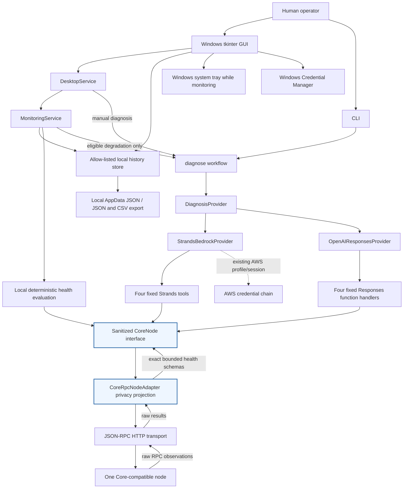

# CoreWarden architecture

CoreWarden separates presentation, deterministic supervision, AI investigation,
and the raw node transport. The same privacy-filtered `CoreNode` interface is
used by manual diagnosis and monitoring escalation.



## Supervisory policy

Monitoring is off until the operator starts it. A cycle calls the same four
read-only node methods used by diagnosis and produces a normalized snapshot:

- `healthy`: no AI call;
- new or materially changed `degraded`: eligible for diagnosis through the explicitly
  selected provider;
- unchanged `degraded`: no repeated diagnosis;
- `unavailable`: record locally without invoking a provider;
- return to `healthy`: record recovery without a recovery AI call.

Fingerprints describe the condition rather than absolute block height. A changing header gap is
represented by stable `0`, `1–5`, `6–50`, `51–500`, or over-`500` severity buckets, so routine sync
progress inside a bucket does not consume AI usage while a meaningful boundary crossing remains
observable.

Automatic investigations are further bounded by a global one-hour cooldown independent of
fingerprint, six attempted provider calls in a rolling 24-hour window, and a 128-entry in-memory
incident ledger. A fingerprint deferred by cooldown or budget remains pending, so it can become
eligible after capacity returns rather than being lost merely because the next snapshot is
unchanged. The GUI exposes only remaining allowance and cooldown duration. These automatic limits
are process-local; manual diagnosis is a separate, user-directed path. Provider-side account
budgets remain the durable control across application restarts.

Cycle and diagnosis locks prevent overlap. Recent GUI history remains bounded in memory. A separate
allow-listed history projection persists the newest 1000 safe events under non-roaming Local
AppData and survives restart; it never stores raw observations or provider output.

## Provider execution limits

The Bedrock provider constructs an explicit `BedrockModel` with a 4,096-token response maximum.
Every Strands invocation receives a six-turn, 12,000-output-token, and 64,000-total-token limit plus
a 120-second cancellation event. Cancelled and turn/token-stopped results fail closed even if
structured output is present. The deadline timer is cancelled and joined on every exit path.
Strands cancellation is cooperative, so an underlying library or network operation that ignores
the signal cannot be killed safely by CoreWarden's thread; the result is still rejected after
control returns.

## Privacy boundary

The JSON-RPC transport can receive raw results for all four allowed methods.
`CoreRpcNodeAdapter` projects each observation onto an exact, bounded health-only
schema before returning it through `CoreNode`. Peer addresses, local/bound addresses,
hostnames, client subversions, peer/session IDs, AS mappings, proxy/listener endpoints,
unknown fields, invalid types, non-finite numbers, and oversized list contents are
discarded at this boundary. Free-form warnings become a controlled presence marker.

Providers receive the adapter, never the transport, and both provider tool paths
repeat the exact projection so a custom `CoreNode` cannot bypass it. Monitoring uses
the same adapter. Diagnostic evidence recording wraps the sanitized interface, so it
does not create a second raw-data path. Persistent history consumes typed, controlled
monitoring events rather than transport/provider payloads, so it does not create a
second weaker sanitization path. JSON and CSV exports use only that persisted schema.

## Desktop and tray lifecycle

Tk owns the only root window and main UI loop. The tray adapter owns one icon and
marshals every menu action back onto the Tk thread. Closing while monitoring is
active hides the existing window; closing while idle exits. Restore never creates
a second window or monitor. Explicit tray Quit stops the current monitor, removes
the icon, and destroys the root.

## Capability boundary

The transport allow-list is exactly:

```text
getblockchaininfo
getnetworkinfo
getpeerinfo
getchaintips
```

There is no generic RPC, wallet, transaction, filesystem, shell, restart, or
remediation capability exposed to either provider.

## Credential boundaries

- OpenAI keys are loaded from Windows Credential Manager in the GUI or from the
  `OPENAI_API_KEY` environment fallback.
- Bedrock uses the operator's existing boto3/AWS profile or session chain.
- RPC username/password or cookie contents are held in memory and are not saved
  by the desktop app.
- The synthetic harness has separate, deliberately public test credentials.
