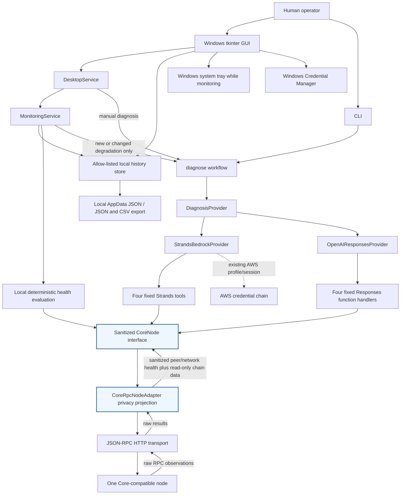

# CoreWarden architecture

CoreWarden separates presentation, deterministic supervision, AI investigation,
and the raw node transport. The same privacy-filtered `CoreNode` interface is
used by manual diagnosis and monitoring escalation.



## Supervisory policy

Monitoring is off until the operator starts it. A cycle calls the same four
read-only node methods used by diagnosis and produces a normalized snapshot:

- `healthy`: no AI call;
- new or materially changed `degraded`: one diagnosis through the explicitly
  selected provider;
- unchanged `degraded`: no repeated diagnosis;
- `unavailable`: record locally without invoking a provider;
- return to `healthy`: record recovery without a recovery AI call.

Fingerprints describe the condition rather than absolute block height, so routine
chain advancement does not consume AI usage. Cycle and diagnosis locks prevent
overlap. Recent GUI history remains bounded in memory. A separate allow-listed
history projection persists the newest 1000 safe events under non-roaming Local
AppData and survives restart; it never stores raw observations or provider output.

## Privacy boundary

The JSON-RPC transport can receive raw `getnetworkinfo` and `getpeerinfo` results.
`CoreRpcNodeAdapter` projects those results onto explicit health-only fields before
returning them through `CoreNode`. Peer addresses, local/bound addresses, hostnames,
client subversions, peer/session IDs, AS mappings, proxy/listener endpoints, and
unknown peer fields are discarded at this boundary.

Providers receive the adapter, never the transport. Monitoring uses the same
adapter. Diagnostic evidence recording wraps the sanitized interface, so it does
not create a second raw-data path. Persistent history consumes typed, controlled
monitoring events rather than transport/provider payloads, so it does not create a
second weaker sanitization path. JSON and CSV exports use only that persisted schema.

## Desktop and tray lifecycle

Tk owns the only root window and main UI loop. The tray adapter owns one icon and
marshals every menu action back onto the Tk thread. Closing while monitoring is
active hides the existing window; closing while idle exits. Restore never creates
a second window or monitor. Explicit tray Quit stops the current monitor, removes
the icon, and destroys the root.

## Capability boundary

The transport allow-list is exactly:

```text
getblockchaininfo
getnetworkinfo
getpeerinfo
getchaintips
```

There is no generic RPC, wallet, transaction, filesystem, shell, restart, or
remediation capability exposed to either provider.

## Credential boundaries

- OpenAI keys are loaded from Windows Credential Manager in the GUI or from the
  `OPENAI_API_KEY` environment fallback.
- Bedrock uses the operator's existing boto3/AWS profile or session chain.
- RPC username/password or cookie contents are held in memory and are not saved
  by the desktop app.
- The synthetic harness has separate, deliberately public test credentials.
